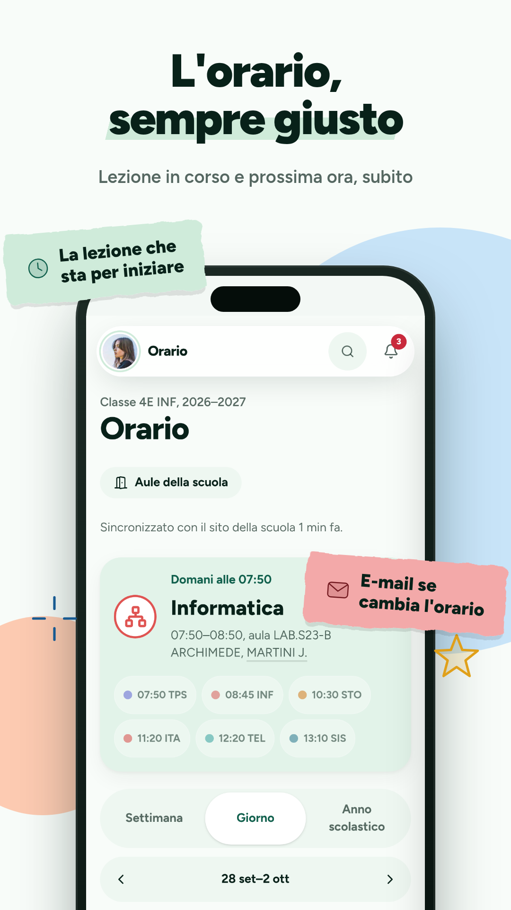

<div align="center">


# Vallaury per Android

**Orario, compiti, verifiche e appunti della tua classe, come app.**

[](LICENSE)


[Sito](https://app.vallaury.it) &nbsp;|&nbsp; [Demo](https://demo.vallaury.it) &nbsp;|&nbsp; [Privacy](PRIVACY.md) &nbsp;|&nbsp; [English](README.md)





</div>

## Che cos'è

[Vallaury](https://app.vallaury.it) è una piattaforma scolastica pensata per studenti e docenti dell'istituto Vallauri di
Fossano. È un progetto indipendente, non la piattaforma ufficiale di nessuna scuola.

Questo repository contiene l'app Android. È piccola di proposito: una
[Trusted Web Activity](https://developer.chrome.com/docs/android/trusted-web-activity/) che apre `https://app.vallaury.it`
a tutto schermo, con le scorciatoie nel launcher, la condivisione di testo e il passaggio delle notifiche al browser.
Non c'è una web view, né rete propria, né archivio dati nell'app. Tutte le funzioni stanno sul sito e arrivano nell'app
appena vengono pubblicate.

| | |
|---|---|
| Pacchetto | `it.vallaury.app` |
| SDK minimo / di destinazione | 23 (Android 6.0) / 36 |
| Codice dell'app | questo repository, [GPL-3.0-only](LICENSE) |
| Codice del servizio | non pubblicato |

## La privacy in breve

| | |
|---|---|
| Permessi | uno: `POST_NOTIFICATIONS`, per mostrare le notifiche da Android 13 in poi |
| Rete | nessun accesso proprio: niente permesso `INTERNET`, le pagine le carica il tuo browser |
| Tracker, statistiche, segnalazione errori, pubblicità | nessuno |
| Google Play Services, Firebase, librerie proprietarie | nessuno |
| Dati salvati dall'app | nessuno su di te; i backup sono disattivati |
| Traffico non cifrato | non consentito |
| Dipendenze | una libreria ([androidbrowserhelper](https://github.com/GoogleChrome/android-browser-helper), Apache-2.0) e ciò che porta con sé da AndroidX; ogni file è fissato da un checksum |

Quello che succede dopo che l'app ha aperto il sito riguarda il sito. Il riassunto onesto è in [PRIVACY.md](PRIVACY.md):
chi gestisce il server, quali servizi esterni stanno nel percorso (il tuo browser e chi lo produce, il servizio di
notifiche del dispositivo, Cloudflare) e dove trovi l'informativa completa.

Non devi fidarti della tabella: puoi controllarla.

```sh
./gradlew :app:assembleRelease
$ANDROID_HOME/build-tools/<versione>/aapt2 dump permissions app/build/outputs/apk/release/app-release-unsigned.apk
```

## Installazione

- **F-Droid:** la richiesta è pronta in [`fdroid/`](fdroid/). Non è ancora nell'indice di F-Droid; questa riga avrà il
  collegamento quando ci sarà.
- **Dai sorgenti:** vedi [Compilazione](#compilazione). L'APK che ottieni non è firmato: firmalo con la tua chiave.

Un APK di F-Droid è firmato da F-Droid, uno di Google Play da Google, una tua compilazione da te. Android non permette di
installarne uno sopra l'altro: prima disinstalla. L'app non tiene dati, quindi non perdi nulla.

## Come apre il sito

1. Se è installato un browser che supporta le Trusted Web Activity (quelli basati su Chromium sì), il sito si apre a tutto
   schermo come un'app, a patto che il sito garantisca per la chiave di firma dell'app (Digital Asset Links, sotto).
2. Altrimenti il sito si apre in una Custom Tab del browser predefinito.
3. Se nessun browser offre le Custom Tab, si apre come un normale collegamento nel browser predefinito.

L'app funziona in tutti e tre i casi. Nel 2 e nel 3 vedi la barra degli indirizzi e le notifiche dipendono da come il
browser gestisce le notifiche web.

### Digital Asset Links e chiave di firma

Per la modalità a tutto schermo, `https://app.vallaury.it/.well-known/assetlinks.json` deve elencare l'impronta SHA-256
della chiave con cui è firmato l'APK installato. Ogni canale di distribuzione ha la sua chiave, quindi ogni impronta è in
quell'elenco. Per leggere l'impronta di un APK:

```sh
$ANDROID_HOME/build-tools/<versione>/apksigner verify --print-certs app-release.apk
```

## Compilazione

Servono JDK 17 e l'Android SDK con la piattaforma 36 e build-tools recenti.

```sh
export ANDROID_HOME=/percorso/dell/android-sdk
./gradlew :app:assembleRelease
# app/build/outputs/apk/release/app-release-unsigned.apk
```

Per chi vuole sapere cosa esegue:

- Il wrapper di Gradle è quello ufficiale per Gradle 8.11.1 (SHA-256 `2db75c40...8046`, il valore pubblicato da Gradle) e
  la CI lo verifica.
- Le dipendenze arrivano solo da Google Maven e Maven Central, e
  [`gradle/verification-metadata.xml`](gradle/verification-metadata.xml) fissa il checksum di ogni file, plugin di
  compilazione compresi.
- Il blocco firmato di metadati delle dipendenze che il plugin Android aggiunge agli APK è disattivato, come le
  informazioni sul controllo di versione. Due compilazioni pulite con gli stessi strumenti danno un APK non firmato
  identico byte per byte.
- Per pubblicare una tua compilazione, firmala con `apksigner`. Nel repository non c'è, e non ci sarà mai, nessuna chiave
  di firma né password.

Per cambiare il sito aperto dall'app, le scorciatoie o i colori, modifica
[`app/src/main/res/values/strings.xml`](app/src/main/res/values/strings.xml),
[`colors.xml`](app/src/main/res/values/colors.xml) e [`xml/shortcuts.xml`](app/src/main/res/xml/shortcuts.xml).

## Struttura del repository

```
app/                         il modulo Android (manifest, risorse, due classi minime)
fastlane/metadata/android/   testi, icona e schermate per F-Droid (en-US, it-IT)
fdroid/                      la ricetta per F-Droid e come si presenta
gradle/                      wrapper e checksum delle dipendenze
LICENSES/                    testi delle altre licenze usate
PRIVACY.md                   cosa fanno l'app e il servizio con i tuoi dati
SECURITY.md                  come segnalare una vulnerabilità
```

## Contribuire

Segnalazioni e patch sono benvenute, per l'app. Leggi prima [CONTRIBUTING.md](CONTRIBUTING.md). I problemi del servizio
(accesso, dati dell'orario, appunti) vanno segnalati dal pulsante di feedback nella web app, non qui.

## Licenza

Il codice e la grafica di questo repository sono rilasciati con la
[GNU General Public License, versione 3 soltanto](LICENSE). Le parti derivate dal modello di Bubblewrap e le librerie
usate mantengono le loro note Apache-2.0, vedi [THIRD_PARTY.md](THIRD_PARTY.md).

La licenza copre questa app, non il servizio che c'è dietro e non il nome: "Vallaury" e il servizio web su `vallaury.it`
appartengono a chi li mantiene. Un fork non deve presentarsi come l'app originale né indirizzare gli utenti al servizio
originale come se fosse suo.
